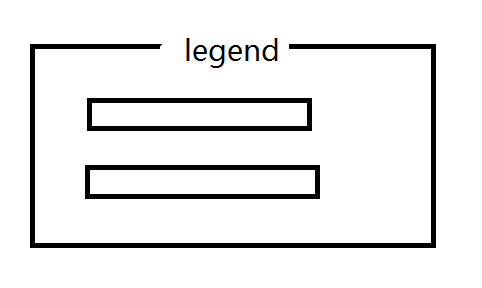
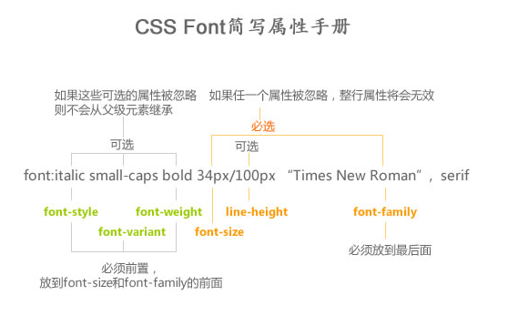

## 一句话tips
* 强制不换行: `white-space: nowrap`
* 空格大小 =  **宋体** 字体下字体大小的一半
* dd,dl{margin: 0}
* p, dt, h1~6 不要嵌套块级标签
* 自定义光标cursor:   `cursor: url(xxx.cur),auto`第二个参数auto以防止路径找不到有备选方案
* ie6 ie7 不支持块属性标签的inline-block;
* less变量声明格式: @val: 100px;

## 之前印象笔记记过的html部分
* 只有body有bgcolor属性：<body bgcolor="#E6E6FA">
* 表格\<table\>  （表头用\<caption\>）

	```html
<table>
     <thead>
          <tr>
               <th><th>
               <th><th>
          </tr>
     </thead>
     <tbody>
          <tr>
               <td colspan="2"><td>
     </tbody>
</table>
```

	* \<table>里加border="1"才管用，在css里不行，只对父元素生效
	* table｛border-collapse：collapse｝
	* 要记得清空padding：th，td｛padding，0；｝

- 表单\<form>

```html
<fieldset>
     <legend>xxx</legend>
</fieldset>
```


- id定义的规则：

    - 下划线，字母开头（下划线不推荐，css2.0会限制使用）

    - 数字，空格，连字号
- XHTML（头部在sublime里敲html:xt，按tab自动生成）
    - id属性代替name属性
    - <xxx  />   注意应该追加一个空格
    - css中   a｛text-decoration：   none｝   也应该追加一个空格

## 之前印象笔记记过的css部分
- transition:1s    代表过渡动画持续1秒，常配合javascript使用
- 自定义列表标志

```css
ul{
  list-style:square inside url('/i/arrow.gif');}
//分开写
li{list-style-image:url();
   list-style-type:square /circle /upper-roman /lower-alpha;
   list-style-position:inside/outside/inherit;}
```

- css文字：
    - font（复合时有顺序：font-weight font-style font-size必须写 / line-height  font-family必须写）
        - font-family:"宋体"
        - font-size：
        - font- weight（100~900）：lighter/bold/bolder(700)/normal(400)
        - font-style:italic/normal/oblique(文本倾斜显示)
        - font-variant:small-caps(例如：THIS IS A BOOK)
    
    - direction（设置文本方向）：rtl/ltr
    - text-align:(left)/center/right，竖直方向用line-height调节
    - text-indent:首行缩进(可继承)，支持块元素，行内元素靠padding/margin实现
    - text-decoration:underline/line-through/overline/none/blink
    - text-transform:none/uppercase/lowercase/capitalize
    - letter-spacing(一般来说字的右边有1px的留白)
    - word-spacing

    - 块级元素居中用左右外边距实现


- 单元格内加入图片时图片下方自带一层白条，所以想要把图片居中只能vertical-align:top;

- display：inline/block/inline-block
    - inline:
        - 内容撑开宽度
        - 不支持上下margin
        - 代码里的换行会被解析为空格分割
    - block：
        - 默认独占一行
        - 没有宽度默认撑开一排
        - 支持宽高
    - inline-block：
        - 块在一行显示
        - 行内属性支持宽高
        - 没有定义宽度是内容撑开宽度
- a:link/visited/hover/active
- 清除浮动的方式
   - br可以清浮动：<br  clear = "all"/>
   - after伪类清浮动：


```
<div class="clear">
     <div style="float:left">....</div>
     <div style="float:right">...</div>
</div>

.clear｛zoom：1；｝
.clear：after｛content:""；display：block；clear：both；｝
```

-  元素透明
    - ｛opacity：0.50~1｝ 。。。。。会连带里边的子元素变透明
    - IE6，7下，｛filter：alpha（opacity=500~100）；｝


- 通用字体系列   ｛font-family：A字体，B字体，C字体；｝
    - Serif：字母带脚，尖尖头
    - sans-serif：不带脚，秃的
    - monospace：老式打字机字体
    - cursive：手写花体
    - fantasy：其他字体
    - Arial≈Helvatica
- css3里，background-size：xxx，指定背景放缩

	> 	background-size:x y  
	> 			background-size:100% 100%  
	> 			cover 放大	一定铺满整个容器，但是图片不一定显示完整
	> 			contain 缩小  不一定会铺满整个容器，但会保证图片比例正常并显示完整
	  
	  
	css3里,background-origin ：指定背景平铺起点  
> background-origin ： border | padding | content 
> 		border-box： 从border区域开始显示背景。   
> 		padding-box： 从padding区域开始显示背景。   
> 		content-box： 从content区域开始显示背景  
> 		平铺是铺满整个容器，包括border  
> 		不平铺是从border以里开始显示  


 	css3里,background-clip: 指定背景裁剪规则
> 	border-box： 从border区域向外裁剪背景。  
> 	padding-box： 从padding区域向外裁剪背景。  
> 	content-box： 从content区域向外裁剪背景。  
> 	no-clip
- 各种对齐：

    - 表格内文本对齐：text-align/vertical-align
    - border-collapse:separate/collapse
    - empty-cells:hide

    - 水平对齐块级元素

        - 将左右margin设置成auto--->均等分配可用外边距
        - `position：absolute；right：0px；left：50%；margin-left：一半宽度`

- 选择器：

    - 后代选择器：p  strong

    - 子选择器：p >  strong

- 导航栏

    - 水平导航栏：
        - li｛float：left；｝     a｛display：block（使链接整个区域内可点击）；width：60px；｝

    - 垂直导航栏：
        - a｛display： block（使链接整个区域内可点击）；width：60px；｝


- 自适应按钮（三层嵌套背景实现）

    - 多层嵌套时，越往里的元素background背景越在上边

```css
#nav li{float: left;height: 28px; }
#nav a{float:left;height:28px;font-size: 16px;color: #ffffff;background: url(../images/nav-btn.png) repeat-x 0 -28px;}
#nav strong{float:left;height:28px;background: url(../images/nav-btn.png) no-repeat right 0;}
#nav span{float:left;height:28px;background: url(../images/nav-btn.png) no-repeat 0 -56px ;padding: 0 16px;}
```


## 关于字体的复合样式
 > 必填项有: **font-size**和**font-family**,例如:`style="font: 20px '微软雅黑';"`
 ----
 > 注: mac上的chrome如果要使用微软雅黑的话,要写成: `font-family: 'Microsoft Yahei'`(英文用`arial`)
 
  
 
 
## 关于背景background的复合样式
*background复合样式写法是没有顺序要求的
			但是，建议人为分类。
			颜色 -> 图片 -> 重复 -> 位置(/大小 裁剪 基点) -> 滚动*
			
```css
background: [background-color] [background-image] [background-repeat]
            [background-attachment] [background-position] / [ background-size]
            [background-origin] [background-clip];
```
实例:

```css
.example {
  background: aquamarine url(img.png)
              no-repeat
              scroll
              center center / 50%
              content-box content-box;
}
```

## 几种图片格式

| 格式 | 用途 |支持透明 | 支持半透明（渐变阴影） |
|:-:|:-:|:-:|:-:|
| gif/png-8  |    小图标  | 是   |否    |
| jpeg |大图海报|否|否|
| png-24|还原度最好|是|是


## BFC(块级格式化上下文)
#### 作用
1. 包含浮动元素(清除浮动)
2. 不被浮动覆盖
3. 阻止父子元素的margin传递

#### 触发条件
1. float值不为none时(有浮动时)
2. overflow的值不为visible时(如hidden,auto,scroll)
3. display值为`table-cell`,`table-caption`,`inline-block`之一
4. position值不为static或relative
5. 加边框(会改变元素的大小,不推荐)

## haslayout(IE下)
#### 作用
1. 包含浮动元素(清除浮动)
2. 不被浮动覆盖
3. 阻止父子元素的margin传递

#### 触发条件
zoom:1可以触发


## h5常用标签
```html
<!DOCTYPE html>
<html>
	<head>
		<meta charset="UTF-8">
		<title></title>
	</head>
	<body>
		<header>
			页眉 
			主要用于页面的头部的信息介绍，也可用于板块头部
		</header>
		<nav>
			<a href="">链接1</a>
			<a href="">链接2</a>
		</nav>
		<footer>页脚  页面的底部 或者 版块底部</footer>
		<section>页面上的版块</section>
		<article>用来在页面中表示一套结构完整且独立的内容部分</article>
		<aside>元素标签可以包含与当前页面或主要内容相关的引用、侧边栏、广告、nav元素组，以及其他类似的有别与主要内容的部分</aside>
		<time>时间</time>
	</body>
</html>
```

## 关于img标签
等比缩放：1、只修改宽度2、只修改高度
				
* alt: 图片加载失败时显示的文字
* title: 鼠标移到元素上提示的文字(图片加载失败时，没有alt属性，那么title也会充当alt的作用)
* img被包裹时会出现缝隙
	vertical-align: top;
* 在IE6下img被a标签包裹时会出现蓝色边框
	border:none
	
	
## css选择器权重


1. 第一等：代表内联样式，如: style=””，权值为1000。
2. 第二等：代表ID选择器，如：#content，权值为100。
3. 第三等：代表类，伪类和属性选择器，如.content，权值为10。
4. 第四等：代表类型选择器和伪元素选择器，如div p，权值为1。
5. 特殊的：通用选择器（*），子选择器（>）和相邻同胞选择器（+）并不在这四个等级中，所以他们的权值都为0。


##  重置默认样式
```css
body,
h1,
h2,
h3,
h4,
h5,
h6,
hr,
p,
dl,
dd{
	margin: 0;
}
ul, ol{
	margin: 0;
	padding: 0;
	list-style: none;
}
a{
	color: #333;
	text-decoration: none;
}
img{
	vertical-align: top;
	border: none;
}
```

## 盒阴影
`box-shadow:[inset] x y blur [spread] color`  
 	**参数:**
 	
* 	inset：投影方式
	* inset：内投影(不给：外投影)
* 	x、y：阴影偏移
* 	blur：模糊半径
* 	spread：扩展阴影半径(先扩展原有形状，再开始画阴影)
* 	color

## 关于表格\<table>标签

```html
<html>
	<head>
		<meta charset="UTF-8">
		<title></title>
		<!--
			table 表格
			thead 表格头
			tbody 表格主体
			tr 表格行
			th 元素定义表头
			td 元素定义表格单元
			
			<table border="1">
				
			table{border-collapse:collapse;} 单元格间隙合并
			th,td{padding:0;}重置单元格默认填充

			colspan  属性规定单元格可横跨的列数。
			<td colspan="2"></td>
			
			rowspan  属性规定单元格可横跨的行数。
			<td rowspan="2"></td>
		-->
		<style>
			table,th,td{
				border: 1px solid black;
			}
			table{
				border-collapse:collapse;
			}
			th,td{
				padding: 0;
			}
			th{
				width: 200px;
				height: 50px;
				background-color: pink;
			}
			td{
				height: 40px;
				text-align: center;
				background-color: palegreen;
			}
		</style>
	</head>
	<body>
		<table>
			<thead>
				<th>星期一</th>
				<th>星期二</th>
				<th>星期三</th>
				<th colspan="2">星期四&五</th>
			</thead>
			<tbody>
				<tr>
					<td rowspan="3">CSS</td>
					<td>HTML</td>
					<td>HTML</td>
					<td colspan="2">CSS&HTML</td>
				</tr>
				<tr>
					<td>HTML</td>
					<td>HTML</td>
					<td>CSS</td>
					<td>HTML</td>
				</tr>
				<tr>
					<td>HTML</td>
					<td>HTML</td>
					<td>CSS</td>
					<td>HTML</td>
				</tr>
				<tr style="height: 10px;"></tr>
				<tr>
					<td>CSS</td>
					<td>HTML</td>
					<td>HTML</td>
					<td>CSS</td>
					<td>HTML</td>
				</tr>
			</tbody>
		</table>
	</body>
</html>
```


# text-overflow(文本溢出)

|值	|描述|
|---|---|	
|clip|修剪文本|
|ellipsis|显示省略符号来代表被修剪的文本。|	 
|string|使用给定的字符串来代表被修剪的文本。|


1. 实现单行文本超出省略号的写法

	```css
p {
	...
	overflow: hidden;
	text-overflow: ellipsis;
	white-space: nowrap;
}
```


2. 实现多行文本最后一行超出省略号的写法

	```css
p {
	...
	//定宽高以后
	overflow: hidden;
	text-overflow: ellipsis;
	display: -webkit-box;
	-webkit-line-clamp: 4;
	-webkit-box-orient: vertical;
}
	/*
	这里用了一个不是很常见的属性 -webkit-line-clamp  
	在WebKit浏览器或移动端（绝大部分是WebKit内核的浏览器）的页面实现比较简单，可以直接使用WebKit的CSS扩展属性(WebKit是私有属性) -webkit-line-clamp ；注意：这是一个 不规范的属性（ unsupported WebKit property ），它没有出现在 CSS 规范草案中。
	
	-webkit-line-clamp 用来限制在一个块元素显示的文本的行数。 为了实现该效果，它需要组合其他的WebKit属性。 常见结合属性：
	
	1，display: -webkit-box; 必须结合的属性 ，将对象作为弹性伸缩盒子模型显示 。
	
	2，-webkit-box-orient 必须结合的属性 ，设置或检索伸缩盒对象的子元素的排列方式 。
	
	3，text-overflow: ellipsis; ，可以用来多行文本的情况下，用省略号“…”隐藏超出范围的文本 。
*/
```

